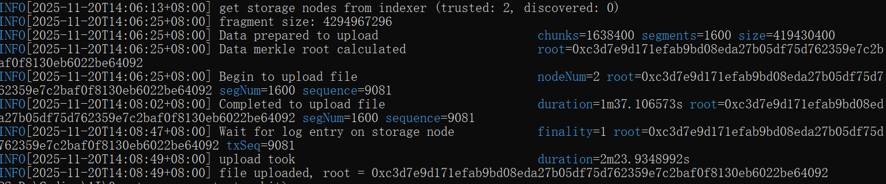

# 0g 共学营第二次作业

本项目基于 [0g-storage-go-starter-kit](https://github.com/0gfoundation/0g-storage-go-starter-kit) 进行修改，演示如何使用 0g-storage-client 生成、切分、上传和查询大文件。

## 参考资源

- **0g-storage-client**: https://github.com/0gfoundation/0g-storage-client
- **0g-storage-go-starter-kit**: https://github.com/0gfoundation/0g-storage-go-starter-kit
- **0G Storage SDK 文档**: https://docs.0g.ai/developer-hub/building-on-0g/storage/sdk

## 环境准备

### 1. 安装 0g-storage-client

请参考官方文档安装 0g-storage-client 工具。

### 2. 配置私钥

本项目通过 Go SDK 集成 0g-storage-client，需要配置私钥。

创建 `.env` 文件并配置私钥（注意：请勿泄露您的私钥）：

```bash
cp .env.example .env
```

编辑 `.env` 文件：

```
PRIVATE_KEY=your_private_key_here
```

## 操作流程

### 步骤 1：生成 4GB 测试文件

使用 0g-storage-client 生成一个 4GB 的测试文件：

```bash
0g-storage-client gen --file test-4gb.dat --size 4294967296
```

### 步骤 2：切分文件

运行 Go 程序将 4GB 文件切分为 10 个 400MB 的文件：

```bash
go run main.go split
```

执行后会在 `chunks/` 目录下生成以下文件：
- `test-4gb-part-01.dat` (400MB)
- `test-4gb-part-02.dat` (400MB)
- ...
- `test-4gb-part-10.dat` (400MB)

### 步骤 3：批量上传文件

通过 Go SDK 将切分后的文件批量上传到 0G Storage 网络：

```bash
go run main.go upload
```

或者使用以下命令进行编译后运行（如遇到 Go 版本问题）：

```bash
go build -ldflags=-checklinkname=0
./0g-storage-starter upload
```

上传成功后会返回每个文件的 `root_hash`，请记录下来以便后续查询。

**上传成功截图：**



### 步骤 4：下载验证文件

通过 Go SDK 下载已上传的文件：

```bash
# 下载单个文件
go run main.go download <ROOT_HASH> [output_filename]

# 示例：
go run main.go download 0x123456... downloaded-part-01.dat
```

下载的文件会保存在 `downloads/` 目录下。

**下载成功截图：**


### 一键执行所有步骤

也可以使用 `all` 命令一次性执行切分、上传和下载验证：

```bash
go run main.go all
```

这将依次执行：
1. 切分文件
2. 上传所有切分文件
3. 下载所有文件进行验证

#### 查询文件信息（可选）

通过 Indexer 的 HTTP API 查询文件信息：

```bash
# 通过 root hash 查询文件信息
curl "https://indexer-storage-testnet-turbo.0g.ai/file/info/<ROOT_HASH>"

# 批量查询多个文件
curl "https://indexer-storage-testnet-turbo.0g.ai/files/info?cid=<ROOT_HASH_1>&cid=<ROOT_HASH_2>"
```

## 网络配置

- **EVM RPC**: `https://evmrpc-testnet.0g.ai`
- **Indexer RPC**: `https://indexer-storage-testnet-turbo.0g.ai`

## 踩坑历程

### 1. Go 版本过高导致编译失败

在编译 0g-storage-client 时，如果遇到以下错误：

```
link: github.com/fjl/memsize: invalid reference to runtime.stopTheWorld
```

这是因为 Go 版本过高导致的兼容性问题。需要使用以下命令进行编译：

```bash
go build -ldflags=-checklinkname=0
```

### 2. 其他操作

其他操作正常按照官方文档进行即可。

## 注意事项

1. **私钥安全**：请妥善保管您的私钥，切勿上传到公开仓库
2. **Gas 费用**：上传文件需要消耗 Gas，请确保账户有足够的测试币
3. **文件大小**：每个切分文件为 400MB，总计 4GB

## 项目结构

```
.
├── main.go          # 文件切分、上传、下载程序（集成 0g-storage-client SDK）
├── .env             # 环境变量配置（私钥）
├── .env.example     # 环境变量示例
├── test-4gb.dat     # 生成的 4GB 测试文件
├── chunks/          # 切分后的文件目录
│   ├── test-4gb-part-01.dat
│   ├── test-4gb-part-02.dat
│   └── ...
├── downloads/       # 下载验证的文件目录
├── img/             # 截图目录
│   ├── upload-success.png
│   └── download-success.png
└── README.md        # 本文档
```

## 可用命令

```bash
go run main.go <command>

# 命令列表：
#   split    - 将 4GB 文件切分为 10 个 400MB 的文件
#   upload   - 将所有切分文件上传到 0G Storage
#   download - 从 0G Storage 下载文件（需要 root hash）
#   all      - 一键执行切分、上传和下载验证
```
